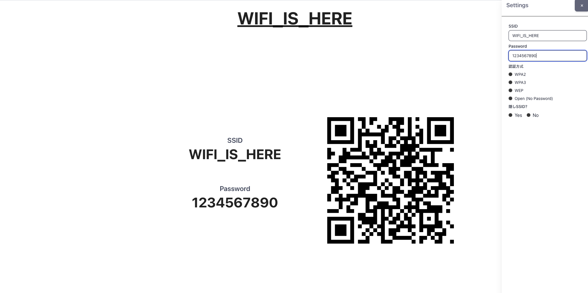

# WiFi is Here

## 概要

シンプルな WIFI QR コード生成 web アプリです。

イベント会場やお店などで WiFi の接続情報を共有するときに使用できます。

## 使い方

設定から必要な情報を入力すると WiFi QR コードを生成します。データは一切保存しません。

お好きな画像をアップロードすることで、カスタマイズできます。

Web ページをそのまま表示しての使用もできますし、スライド用に画像をダウンロード、印刷することもできます。



## ローカルでの開発

```bash
npm install
npm run dev
```

## ビルド

```bash
npm run build
```
